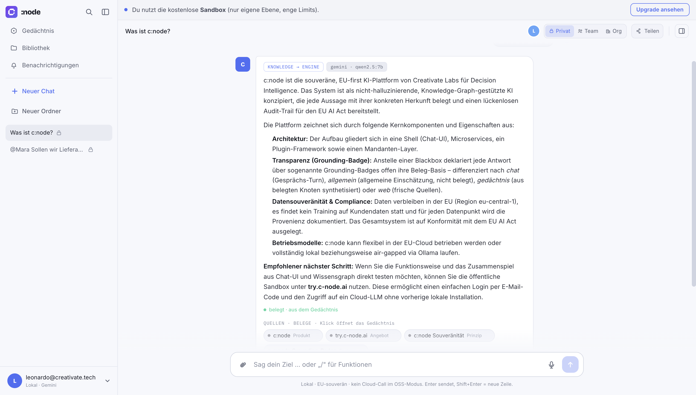
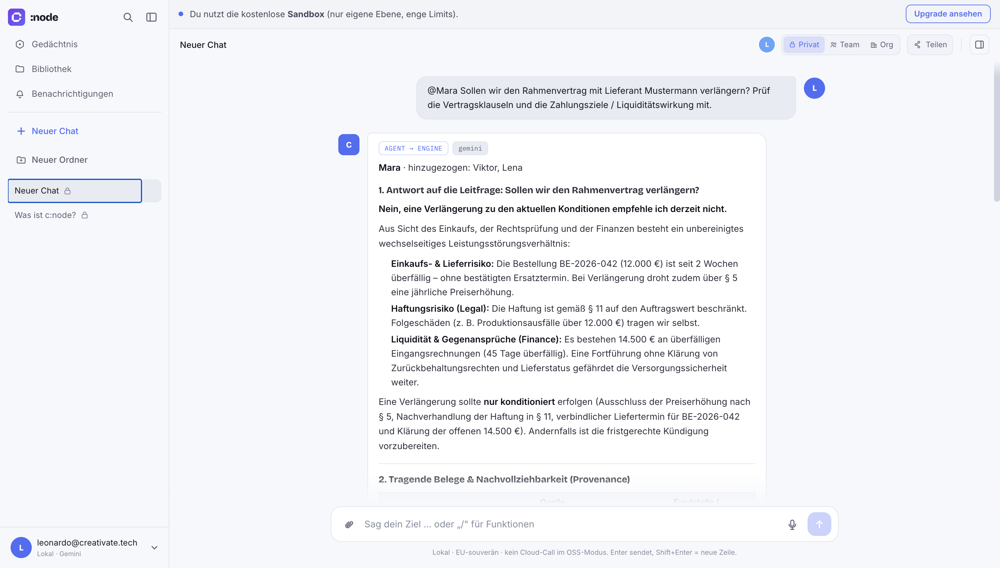
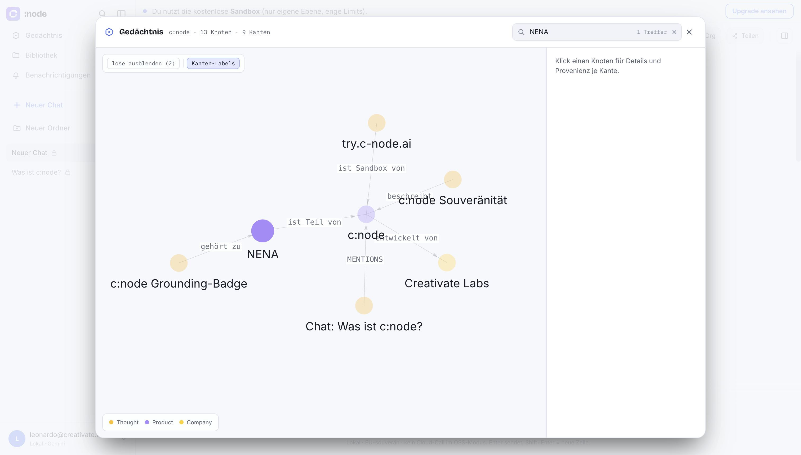
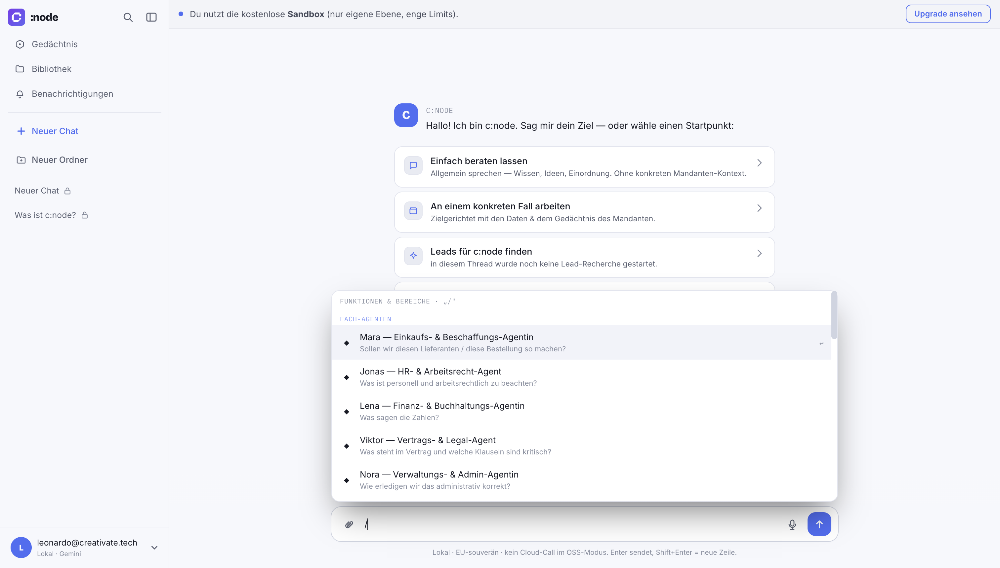

<div align="center">

# c:node

**Sovereign, evidence-backed AI — chat + a knowledge-graph memory + named domain agents, self-hostable.**

**The surface is open. The intelligence is ours.** — *c:node steers · NENA thinks · the agents act.*

[](LICENSE)
[](#open-core)
[](COMMERCIAL.md)
[](#quickstart)
[](#why-cnode)

[**Live demo → try.c-node.ai**](https://try.c-node.ai)

<br/>



<br/>



</div>

---

## Why c:node

Most assistants answer confidently and leave you guessing where it came from. c:node is built the
other way around:

- **Evidence, not a black box.** Every factual claim is bound to a source (a document, a booking
  line, a contract clause, a catalog entry) with provenance and an audit trail — the EU-AI-Act
  stance of *source & reasoning per statement*. **No source → no claim.**
- **A memory that grows (NENA).** A pgvector knowledge graph that learns from your **files,
  artifacts, connectors and chats** — isolated per tenant/workspace, so nothing bleeds across users.
- **Named domain agents** (Procurement, HR, Finance, Contracts, Admin, Ops) with **agent-to-agent
  delegation**: the right agent pulls in siblings when a sub-question leaves its domain, and the
  provenance travels with it. Anything with an outside effect goes through a **human-in-the-loop gate**.
- **Sovereign by default.** Runs on local Ollama out of the box — no cloud call required. Cloud LLMs
  are optional (BYOK).
- **Two surfaces, one behavior.** The in-app chat **and** MCP skills (`cnode.agent.<slug>`) —
  identical grounding and isolation on both.

## Quickstart

Requires Docker + Docker Compose. For local answers, run [Ollama](https://ollama.com) with a model
(`ollama pull qwen2.5:7b`) — or bring your own key (see below).

```bash
git clone https://github.com/CreativateLabs/cnode-shell
cd cnode-shell
cp .env.example .env            # optional: adjust
docker compose up --build       # builds from source; tenant defaults to `cnode`
```

The root `compose.yaml` bundles the `infra/` overlays for you. Prefer them explicit
(or to pick a different `TENANT`)? This is the exact equivalent:

```bash
TENANT=cnode docker compose \
  -f infra/docker-compose.yml \
  -f infra/docker-compose.tenant.yml \
  -f infra/docker-compose.oss.yml up --build
```

- **Shell:** http://localhost:3010 · **API:** http://localhost:8080
- The `oss` overlay builds everything from source and enables **semantic memory** via a small
  built-in CPU embedder (no GPU needed).

### Bring your own LLM (optional)

In `.env`:

```bash
DEFAULT_PROVIDER=gemini          # or: claude | ollama (default)
GOOGLE_API_KEY=AIza…             # for gemini
ANTHROPIC_API_KEY=sk-ant-…       # for claude
```

## How it works

```
        files · artifacts · connectors · chats
                        │  (ingest, per-tenant)
                        ▼
   ┌──────────────┐   grounded    ┌──────────────────────────┐
   │  NENA graph  │◀────────────▶ │  engine (retrieval +      │
   │  (pgvector)  │   retrieval   │  synthesis, provenance)   │
   └──────────────┘               └────────────┬─────────────┘
                                                │
                        chat  ·  domain agents (A2A)  ·  MCP skills
                                                │
                                   human-in-the-loop gate → connectors
```

| Service | Role |
|---|---|
| `apps/shell` | React/Vite chat UI |
| `services/bff` | Gateway: auth, routing, tenant isolation, agent orchestration, write-gate |
| `services/engine` | LLM proxy + 3-layer retrieval + evidence-backed synthesis |
| `services/graph-core` | pgvector graph runtime (the memory) |
| `services/embed` | small CPU embedder (fastembed / ONNX, 768-dim) |
| `services/assets` | library/upload + text extraction → graph |
| `services/mcp` | MCP server exposing agents as `cnode.agent.<slug>` |

Tenants live as config under `tenants/` (`cnode` is the default). Extend via plugins, don't fork
(`platform/`).

## Domain agents

Six named personas ship live — **Procurement, HR, Finance, Contracts, Admin, Ops**. Ask one directly
in the chat with `@<name> <question>` (or pick it from the `/` command palette). A consultation
grounds on the tenant memory, cites its sources, delegates to sibling agents when the facts call for
it, and prepares (never auto-executes) any outward action for your approval.

## Open-core

c:node is **open core**, not "everything for free". Three layers, cleanly separated:

- **The surface — open (AGPL-3.0).** The shell/UI and the base graph runtime (`graph-core` with
  provenance per edge, lexical + semantic retrieval) are in this repo. A working, air-gapped
  baseline you can self-host and audit end to end.
- **The intelligence — commercial.** The trained NENA engine (accumulated ontology & extraction
  quality, curated data assets, domain tuning, EU-AI-Act conformity, operations & SLA) is **not**
  in this repo — the open core calls it through an adapter. That is the licensed value.

The hosted offering (cloud LLM included, shared market/mesh intelligence, multi-tenant, billing,
analytics, SLA) runs on the same open core. For closed-source or white-label use, a **commercial
license** lifts the AGPL copyleft — see [COMMERCIAL.md](COMMERCIAL.md).

## Contributing

See [CONTRIBUTING.md](CONTRIBUTING.md). In short: extend via plugins (not forks), keep the evidence
requirement and hard tenant isolation, never commit secrets or customer data. Because c:node is
dual-licensed, contributions require agreeing to the [CLA](CLA.md) (so we can offer the commercial
license alongside the AGPL).

## License

**Dual-licensed.**

- **[AGPL-3.0](LICENSE)** for open-source / self-hosted use — if you run c:node as a network
  service, share your changes under the same terms.
- **[Commercial license](COMMERCIAL.md)** for closed-source, OEM or white-label use that the AGPL's
  copyleft does not permit.

Same code, your choice of terms — contact us for the commercial path.

<div align="center"><sub>A project by <a href="https://creativate.tech">Creativate Labs</a>.</sub></div>
