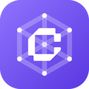
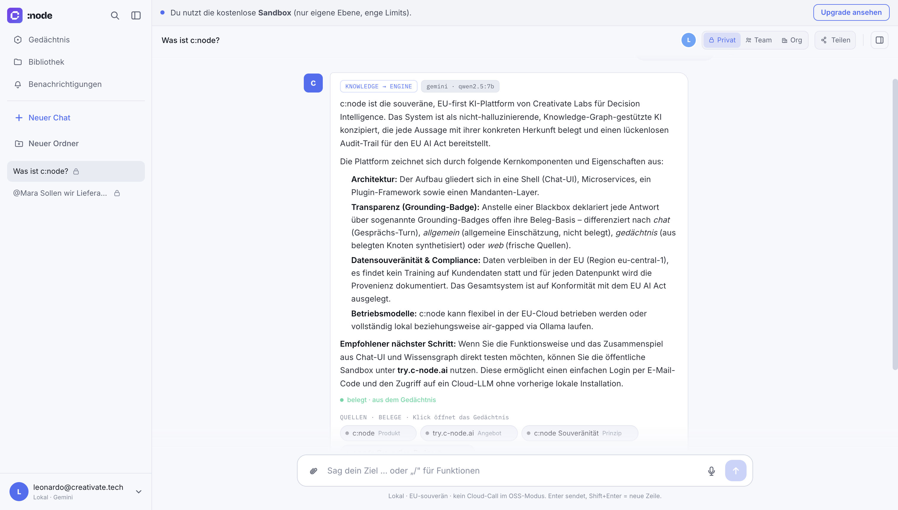
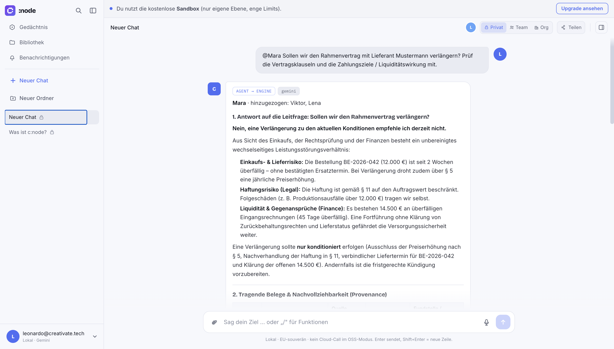
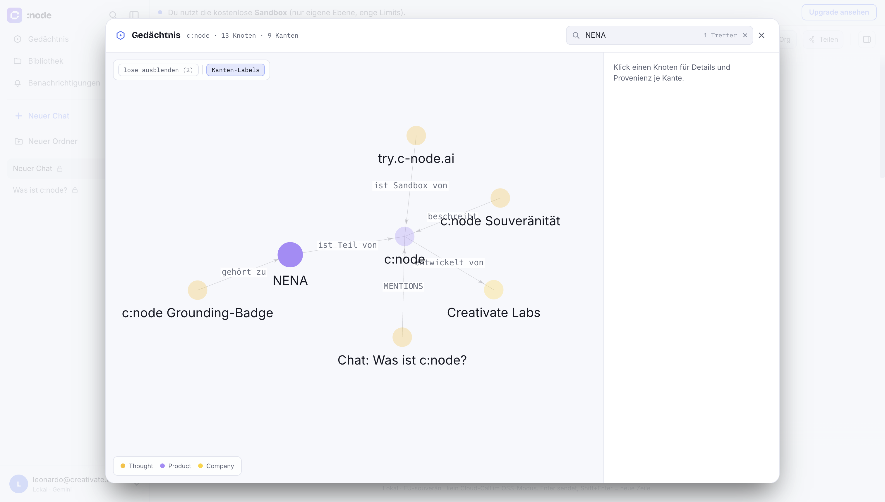
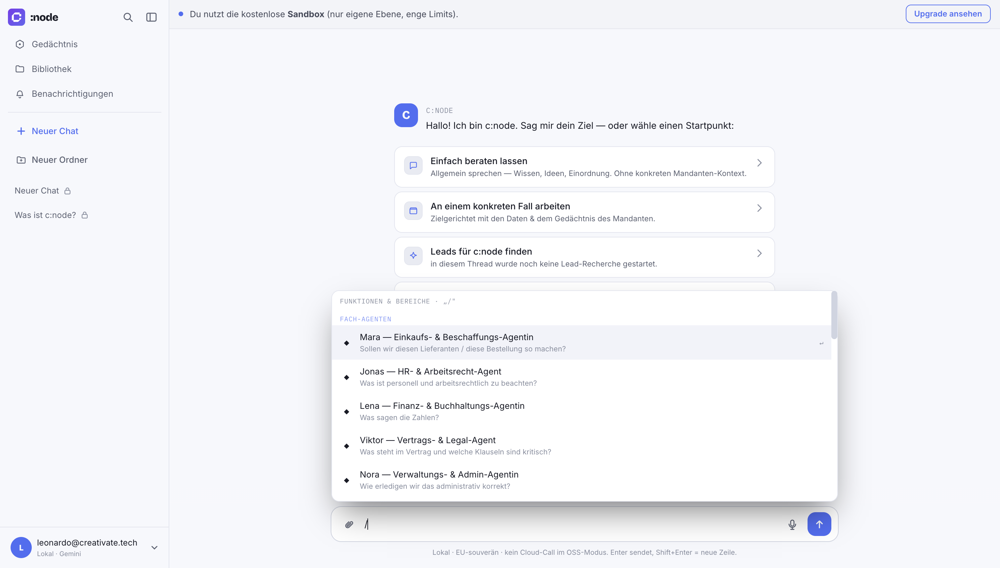
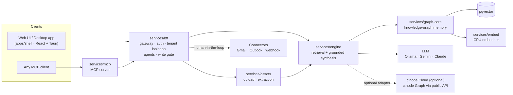

<a name="readme-top"></a>

<div align="center">



# c:node Shell

**The open-source, self-hostable AI workspace where every answer shows its source.**

Chat · knowledge-graph memory · named domain agents · MCP — runs on your machine with local models.

[](LICENSE)
[](https://github.com/CreativateLabs/cnode-shell/tags)
[](https://github.com/CreativateLabs/cnode-shell/actions/workflows/ci.yml)
[](https://github.com/CreativateLabs/cnode-shell/stargazers)
[](#-quickstart)
[](#bring-your-own-model)

[**Live demo → try.c-node.ai**](https://try.c-node.ai) · [Quickstart](#-quickstart) · [Architecture](#-architecture) · [Roadmap](#-roadmap) · [Contributing](CONTRIBUTING.md)

<br/>



<br/>



</div>

> 🇩🇪 **Kurz auf Deutsch:** c:node Shell ist eine quelloffene (AGPL-3.0), selbst hostbare KI-Arbeitsumgebung:
> Chat, Wissensgraph-Gedächtnis und Fach-Agenten — lokal mit Ollama, ohne Cloud-Zwang. Jede Aussage wird an
> eine Quelle gebunden. Die Oberfläche ist auf Deutsch, Englisch und Französisch verfügbar. Fragen und Beiträge
> gerne auch auf Deutsch.

---

## Why c:node Shell

Most AI assistants answer confidently and leave you guessing where the answer came from. c:node Shell is
built the other way around:

- **Evidence, not a black box.** Answers are grounded on your own sources (documents, notes, catalog
  entries) and show them with provenance. The design rule is simple: *no source, no claim*.
- **A memory that grows.** A pgvector knowledge graph learns from your files, artifacts, connectors and
  chats — isolated per workspace, so nothing leaks between tenants.
- **Named domain agents.** Procurement, HR, Finance, Contracts, Admin and Ops personas that can pull in
  each other when a question crosses domains. Anything with an outside effect waits for a
  **human-in-the-loop** approval.
- **Sovereign by default.** Runs against local [Ollama](https://ollama.com) out of the box — no cloud call
  required. Gemini or Claude are optional (bring your own key).
- **One behavior, two surfaces.** Use the agents in the chat UI **or** from any MCP client
  (`cnode_ask_agent`, `cnode_consult_agent`).
- **Web and desktop.** Browser UI plus a native desktop app (Tauri v2) for macOS, Windows and Linux.

## ✨ Features

| | |
|---|---|
| 💬 **Grounded chat** | Streaming chat with sources and a grounding badge per answer |
| 🕸️ **Knowledge-graph memory** | pgvector graph with lexical + semantic retrieval and provenance per edge |
| 📥 **Ingest** | Upload PDF, DOCX, XLSX, CSV, Markdown or text — content is extracted and written to the graph |
| 🤝 **Domain agents (A2A)** | `@agent` mentions and a `/` command palette; agent-to-agent delegation keeps provenance |
| ✋ **Write gate** | Outbound actions (e.g. mail drafts) are prepared, never auto-executed |
| 🔌 **Connectors** | Gmail / Google Drive, Microsoft Outlook (OAuth), generic webhook — via a plugin registry |
| 🧩 **Plugin SDK** | Four plugin kinds: `connector`, `format`, `agent`, `system` ([platform/README.md](platform/README.md)) |
| 🛰️ **MCP server** | Exposes the agents as MCP tools over stdio or streamable HTTP ([services/mcp](services/mcp/README.md)) |
| 🎙️ **Voice** | Local speech-to-text (faster-whisper) |
| 🎨 **Config-driven branding** | Tenants and themes live in `tenants/<slug>/tenant.yaml` — no fork needed |
| 🌍 **Trilingual UI** | Deutsch · English · Français |

## 🚀 Quickstart

**Prerequisites:** Docker with Compose v2, Node.js 20+ with [pnpm](https://pnpm.io), and
[Ollama](https://ollama.com) for local answers (or a cloud key, see below).

```bash
# 0) a local model (skip if you bring your own key)
ollama pull qwen2.5:7b

# 1) backend: graph, engine, gateway — built from source
git clone https://github.com/CreativateLabs/cnode-shell
cd cnode-shell
cp .env.example .env
docker compose up --build -d

# 2) web UI
cd apps/shell
pnpm install
pnpm dev
```

Open **http://localhost:3010** (UI) — the API gateway runs on **http://localhost:8080**.

The root `compose.yaml` bundles three overlays. The explicit equivalent (handy to pick another tenant):

```bash
TENANT=cnode docker compose \
  -f infra/docker-compose.yml \
  -f infra/docker-compose.tenant.yml \
  -f infra/docker-compose.oss.yml up --build -d
```

The `oss` overlay builds everything from source and adds a small CPU embedder for semantic memory —
no GPU needed. `make help` lists further shortcuts (`make health`, `make logs`, `make down`).

If the graph backend is unreachable, the assistant does not improvise: questions that need evidence
get an explicit "no evidenced source right now" reply, marked as not grounded and without sources.

**Desktop app:** `make shell` runs the Tauri app in dev mode (needs the
[Tauri prerequisites](https://v2.tauri.app/start/prerequisites/)). Tagged releases build installers
(`.dmg`, `.msi`, `.AppImage`) via [`.github/workflows/release.yml`](.github/workflows/release.yml).

### Bring your own model

In `.env`:

```bash
DEFAULT_PROVIDER=ollama          # ollama (default) | gemini | claude
OLLAMA_MODEL=qwen2.5:7b
GOOGLE_API_KEY=                  # for gemini
ANTHROPIC_API_KEY=               # for claude
```

Keys stay in your `.env` (gitignored) and are only sent to the provider you choose.

## 🏗 Architecture


```mermaid
flowchart LR
  subgraph Clients
    UI["Web UI / Desktop app<br/>(apps/shell · React + Tauri)"]
    MCPC["Any MCP client"]
  end
  MCP["services/mcp<br/>MCP server"]
  BFF["services/bff<br/>gateway · auth · tenant isolation<br/>agents · write gate"]
  ENG["services/engine<br/>retrieval + grounded synthesis"]
  GC["services/graph-core<br/>knowledge-graph memory"]
  DB[("pgvector")]
  EMB["services/embed<br/>CPU embedder"]
  AS["services/assets<br/>upload · extraction"]
  LLM["LLM<br/>Ollama · Gemini · Claude"]
  CON["Connectors<br/>Gmail · Outlook · webhook"]
  CLOUD["c:node Cloud (optional)<br/>c:node Graph via public API"]

  UI --> BFF
  MCPC --> MCP --> BFF
  BFF --> ENG
  BFF --> AS --> ENG
  BFF -. "human-in-the-loop" .-> CON
  ENG --> GC --> DB
  GC --> EMB
  ENG --> LLM
  ENG -. "optional adapter" .-> CLOUD
```

| Path | Role |
|---|---|
| `apps/shell` | React + Vite + Tailwind UI, Tauri v2 desktop wrapper |
| `services/bff` | Gateway: auth, routing, tenant isolation, agent orchestration, write gate |
| `services/engine` | LLM proxy, retrieval, evidence-backed synthesis |
| `services/graph-core` | pgvector knowledge-graph runtime (the memory) |
| `services/embed` | Small CPU embedder (fastembed / ONNX, 768-dim) |
| `services/assets` | Library, upload, text extraction into the graph |
| `services/voice` | Local speech-to-text |
| `services/ontology-studio` | Ontology suggestions from table columns (schema.org / FIBO / ISO), deterministic |
| `services/mcp` | MCP server exposing the agents |
| `services/domain-*` | Reference domain services built on `packages/cnode-sdk` |
| `platform/` | Plugin framework (connectors, formats, agents, systems) |
| `tenants/` | Tenant config + brand theme (`cnode` is the default; `_template` to start your own) |

## ⚙️ Configuration

| Variable | Default | Purpose |
|---|---|---|
| `TENANT` | `cnode` | Which `tenants/<slug>/tenant.yaml` to mount |
| `GRAPH_BACKEND` | `graph-core` | Graph runtime: in-repo `graph-core`; `nen-cig` = optional external c:node Graph (`NEN_AI_URL`) |
| `DEFAULT_PROVIDER` | `ollama` | LLM provider for new chats |
| `OLLAMA_BASE_URL` | `http://host.docker.internal:11434` | Where Ollama runs |
| `OLLAMA_MODEL` / `DEFAULT_MODEL` | `qwen2.5:7b` | Local model |
| `AUTH_SECRET` | dev placeholder | **Set your own** before exposing the stack |
| `SUPERADMIN_EMAIL` | empty | Email that becomes the instance super-admin — set your own |
| `GOOGLE_OAUTH_*`, `MICROSOFT_*` | empty | Optional connector OAuth apps |
| `VITE_GATEWAY_URL` | `http://localhost:8080` | Gateway the UI talks to |

Start a new tenant with `make tenant-new NAME=<slug>` and point `TENANT=<slug>` at it.

## ☁️ Open core: what's in this repo, and what isn't

c:node is **open core**. This repository is a complete, working, self-hostable product — not a teaser.

| | **c:node Shell** (this repo, AGPL-3.0) | **c:node Cloud** (hosted, commercial) |
|---|---|---|
| Chat UI, desktop app, MCP server | ✅ | ✅ |
| Knowledge-graph memory on your own data | ✅ `graph-core` | ✅ |
| Domain agents, write gate, connectors, plugin SDK | ✅ | ✅ |
| Local models (Ollama) / bring your own key | ✅ | ✅ |
| **c:node Graph** — curated, continuously maintained market & domain knowledge | — | ✅ via API / MCP |
| Managed hosting, multi-tenant operations, SSO, support & SLA | — | ✅ |

The shell talks to c:node Graph only through a public API adapter; it is fully usable without it.
For closed-source, OEM or white-label use that the AGPL does not permit, see [COMMERCIAL.md](COMMERCIAL.md).

## 🔒 Privacy & telemetry

The shell collects **no usage telemetry**. Network calls go only to the LLM provider you configure and to
integrations you explicitly enable (connectors, optional scout features). Your data stays in the Docker
volumes on your machine.

## 🗺 Roadmap

Direction, not promises — vote with 👍 on issues or open a feature request.

- [ ] OpenAI-compatible provider (vLLM, LM Studio, LiteLLM, llama.cpp server)
- [ ] One-command install script and prebuilt container images
- [ ] More connectors (Nextcloud, SharePoint, Confluence, IMAP, local folders)
- [ ] Shareable agent templates (YAML) and a template gallery
- [ ] MCP *client* support: use external MCP servers as tools inside the chat
- [ ] Reusable citation / evidence UI component
- [ ] Signed desktop builds (macOS notarization, Windows code signing)
- [ ] Docs site with deployment guides (Docker, Kubernetes)

## 👪 Community & support

- **Questions & bugs:** [GitHub Issues](https://github.com/CreativateLabs/cnode-shell/issues)
- **Security:** please report privately — see [SECURITY.md](SECURITY.md)
- **Contributing:** start with [CONTRIBUTING.md](CONTRIBUTING.md) and issues labelled
  [`good first issue`](https://github.com/CreativateLabs/cnode-shell/labels/good%20first%20issue)
- **Code of conduct:** [CODE_OF_CONDUCT.md](CODE_OF_CONDUCT.md)
- **Changes:** [CHANGELOG.md](CHANGELOG.md)

## 📚 License

**Dual-licensed.**

- **[AGPL-3.0](LICENSE)** for open-source and self-hosted use. If you run a modified version as a network
  service, you must make your changes available under the same terms.
- **[Commercial license](COMMERCIAL.md)** for closed-source, OEM or white-label use.

Contributions are accepted under the [CLA](CLA.md), so both licenses can be offered.

<div align="center"><sub>Built by <a href="https://creativate.tech">Creativate Labs</a> · <a href="https://c-node.ai">c-node.ai</a> · <a href="#readme-top">back to top ↑</a></sub></div>
